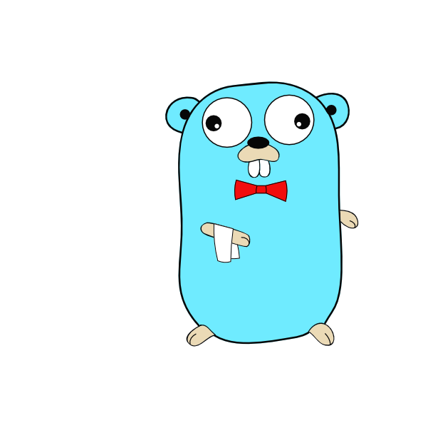

# go2jenkins


Create coverage files for golang that the Jenkins coverage plugin can read and display.
Including complexity metrics and branch coverage.

## Installation
Simple install it by `go install`:
```
go install https://github.com/Fabianexe/go2jenkins@latest
```

## Usage
`go2jenkins` can be run without any arguments.
However, this means that it will for sources in the current directory, 
do not add coverage data and write a `coverage.xml` in the current directory.

So some flags exists to change this behavior:
### Flags
* `-h` or `--help` to get a help message
* `-s` or `--source` to specify the source directory
* `-c` or `--coverage` to specify the coverage profile as written by `go test -coverprofile`
* `-o` or `--output` to specify the output file
* `-v` or `--verbose` to get more output. Can be used multiple times to increase the verbosity

Beside these flags, the following flags can be used to change the behavior of the coverage report:
* `--cyclomatic` to use cyclomatic complexity metrics (default is cognitive complexity)
* `--generatedFiles` to include generated files in the coverage report 
* `--noneCodeLines` to include none code lines in the coverage report 
* `--errorIf` to include error ifs in the coverage report 

### Example
```
go2jenkins -s ./src -c ./coverage.out -o ./coverage.xml
```
This will create a coverage report for the sources in the `./src` directory,
using the coverage profile `./coverage.out` and write the report to `./coverage.xml`.

## The accuracy of `go test -coverprofile`
The `go test -coverprofile` command is a great tool to get coverage information about your project.
However, it measures the coverage on a bock level. This means that if you function contains empty lines, only comments,
or lines with only a closing bracket, they will be counted in line metrics.

This project tries to solve this problem by using the `go/ast` package to determine the actual lines of code from the source.

Another result from this is that branches on a line level can be determined. If a line contains an `if` statement,
with multiple conditions, it is still one block for the coverage profile. There are projects that try to solve this problem
for example [gobco](https://github.com/rillig/gobco). However, they for the moment not compatible with the Jenkins coverage plugin.
Thus, we add branch coverage on method and file level. Where such multi condition statements are counted as one branche.

## Source code Filter
There are parts of the source code that are not included in the coverage report.
At the moment, the following parts are excluded:
* Generated files
    * Files that have a comment that includes `Code generated by` before the package keyword are excluded
* None code lines
    * Empty lines
    * Lines that only contain a comment
    * Lines that only contain a closing bracket
* Error ifs
    * If statements that only contain an error check (`if err != nil`) with only a return in the body are excluded

You can deactivate these filters by using the corresponding flags.

Sure, here is the information in Markdown format:

## Cyclomatic Complexity vs Cognitive Complexity

Cyclomatic Complexity and Cognitive Complexity are both software metrics used to measure the complexity of a program. They are used to determine the quality of code and identify areas that might need refactoring. However, they approach the measurement of complexity from different perspectives.

### Cyclomatic Complexity

Cyclomatic Complexity, introduced by Thomas McCabe in 1976, is a quantitative measure of the number of linearly independent paths through a program's source code. It is computed using the control flow graph of the program. The cyclomatic complexity of a section of source code is the count of the number of linearly independent paths through the source code. It is computed as:

```
Cyclomatic Complexity = Edges - Nodes + 2*Connected Components
```

Cyclomatic Complexity is primarily used to evaluate the complexity and understandability of a program, and it can also give an idea of the number of test cases needed to achieve full branch coverage.

### Cognitive Complexity

Cognitive Complexity, introduced by SonarSource, is a measure that focuses on how difficult the code is to understand by a human reader. It considers things like the level of nesting, the number of break or continue statements, the number of conditions in a decision point, and the use of language structures that unnecessarily increase complexity.

Cognitive Complexity aims to produce a measurement that will correlate more closely with a developer's experience of a code base, making it easier to identify problematic areas of code that need refactoring.

### Summary

In summary, while Cyclomatic Complexity is a measure of the structural complexity of a program, Cognitive Complexity is a measure of how difficult a program is to understand by a human reader. 
Both are useful, but they serve different purposes and can lead to different conclusions about the code's quality.

By default `go2jenkins` uses Cognitive Complexity. You can change this behavior by using the `--cyclomatic` flag.

## Others
So far we are aware about two other projects that do something similar:
* [gocov-xml](https://github.com/AlekSi/gocov-xml)
* [gocover-cobertura](https://github.com/boumenot/gocover-cobertura)

However, both of them focus on the coverage part and take over a big downsides of the `go test -coverprofile` command.
Only packages with any coverage are included in the report ([will be fixed in go](https://go-review.googlesource.com/c/go/+/495447)).
This means that if you have a package with no tests at all, it will not be included in the report.
This is a big problem if you want to have a complete report of your project or any meaningfully coverage metrics.

Further this project is more about the Jenkins integration. So it is more than just a coverage tool.
It adds complexity metrics, more options to determine coverage, and branch coverage.